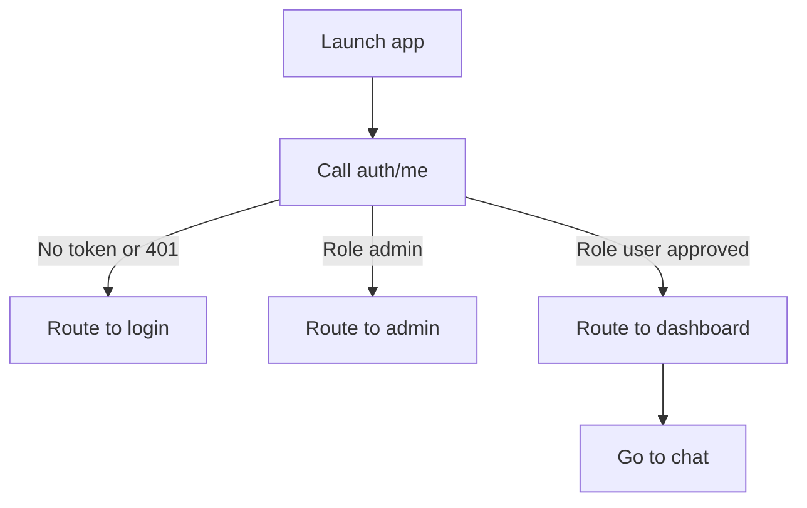

# Frontend Auth Integration Plan

## Context Summary
- Existing chat UI is a single-page component in [`frontend/src/App.tsx`](frontend/src/App.tsx:1) and is currently mounted directly in [`frontend/src/main.tsx`](frontend/src/main.tsx:1).
- Auth endpoints are available in backend router [`backend/app/routers/auth.py`](backend/app/routers/auth.py:1) with schemas in [`backend/app/schemas/auth.py`](backend/app/schemas/auth.py:1).

## Target Routes
- `/register` → Register page
- `/login` → Login page
- `/admin` → Admin dashboard (pending users + approve/reject)
- `/dashboard` → Normal user dashboard (entry to chat)
- `/chat` → Existing chat app UI (current [`frontend/src/App.tsx`](frontend/src/App.tsx:1) becomes ChatPage)

## Auth State + API Client
- Create a small API module to wrap `fetch` with base URL, JSON headers, and bearer token from localStorage.
- Store `access_token`, `refresh_token`, and `token_type` from `/auth/login` response.
- Implement `getCurrentUser` calling `/auth/me` to determine role and approval state.

## Routing + Guards
- Introduce React Router in [`frontend/src/main.tsx`](frontend/src/main.tsx:1).
- Add an `AuthProvider` to load `/auth/me` on app load and expose `user`, `loading`, `login`, `logout`.
- Protect `/admin` with role check (`admin`).
- Protect `/dashboard` and `/chat` with approved user check (`user` and `is_approved`).
- Default route behavior:
  - If not authenticated → redirect to `/login`.
  - If authenticated and admin → redirect to `/admin`.
  - If authenticated and user → redirect to `/dashboard`.

## Pages
- Register: form with name, email, password; call `/auth/register`; display pending approval notice.
- Login: form with email/password; call `/auth/login`; store tokens; call `/auth/me`; route based on role.
- Admin dashboard:
  - Fetch pending users from `/auth/admin/pending` on load.
  - Render list with Approve and Reject buttons.
  - Approve/reject calls `/auth/admin/users/{user_id}/approval` with `is_approved` true/false.
  - Optimistically update list or refetch on success.
- User dashboard:
  - Basic landing with button to enter `/chat` and summary of account status.

## Component Reuse
- Extract current chat UI from [`frontend/src/App.tsx`](frontend/src/App.tsx:1) into a dedicated `ChatPage` component to be routed at `/chat`.
- Add shared layout or nav bar across pages for Logout.

## Error Handling
- Show inline errors for register/login (401, 403, 409).
- For `User not approved` on login (403), show pending approval message.
- For admin actions, display per-user action feedback.

## Styling
- Continue Tailwind usage as in [`frontend/src/index.css`](frontend/src/index.css:1).

## Mermaid Flow

## Files to Touch (Implementation)
- [`frontend/src/main.tsx`](frontend/src/main.tsx:1)
- [`frontend/src/App.tsx`](frontend/src/App.tsx:1) (extract chat UI or convert to router shell)
- New pages in [`frontend/src/pages/`](frontend/src/pages/:1)
- New auth utilities in [`frontend/src/services/`](frontend/src/services/:1)
