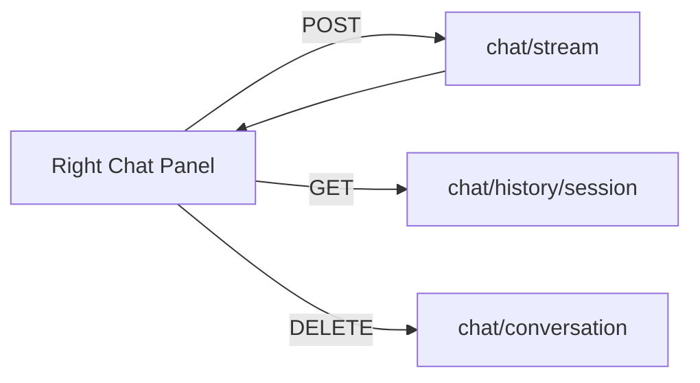

# Frontend Chat Implementation Plan

## Scope
Build a React + TypeScript chat UI in the Vite frontend that:
- Streams responses from POST `/chat/stream` via SSE.
- Fetches chat history via GET `/chat/history/{session_id}`.
- Deletes chat history via DELETE `/chat/{conversation_id}` (using the conversation_id returned by history/stream completion).
- Places chat toolbar on the right, leaving the left side black for now.

## Assumptions
- Backend base URL: `http://localhost:8000`.
- SSE payloads follow the backend plan: events with `type` in `status | chunk | complete` and `content` string.
- `session_id` stored in `localStorage`, created once if missing.

## Data Contracts (Frontend Types)
- `ChatMessage`:
  - `id`: string (client-generated for UI)
  - `role`: 'user' | 'assistant' | 'system'
  - `content`: string
  - `createdAt`: string (ISO)
- `SseEvent`:
  - `type`: 'status' | 'chunk' | 'complete'
  - `content`: string
  - `metadata?`: object
  - `conversation_id?`: string (if backend includes it on `complete`)
- `HistoryResponse`:
  - `conversation_id`: string
  - `messages`: Array<{ role: string; content: string; created_at: string }>
- `DeleteResponse`:
  - `{ success: true }` or empty (client treats 2xx as success)

## API Flow
1. **Session bootstrap**
   - On load, read `session_id` from `localStorage`.
   - If missing, generate `crypto.randomUUID()` and store.
2. **Fetch history**
   - GET `/chat/history/{session_id}`.
   - If present, map messages to `ChatMessage` and set `conversationId` state.
3. **Send message + stream**
   - POST `/chat/stream` with `{ session_id, message }`.
   - Use `fetch` with `ReadableStream` to parse SSE lines.
   - On `chunk`, append to current assistant message.
   - On `complete`, finalize message and store `conversation_id` if provided.
4. **Delete history**
   - Call DELETE `/chat/{conversation_id}`.
   - Clear messages and `conversationId` in state.

## UI Layout Plan
- **Root layout**: full-height split with left black panel (empty) and right chat panel.
- **Right panel**:
  - Header with title and Delete button.
  - Scrollable message list.
  - Input area with textarea and Send button.
- **Message styling**:
  - User messages aligned right.
  - Assistant messages aligned left.
  - Subtle background and spacing.

## State & Streaming Handling
- Local state in [`frontend/src/App.tsx`](frontend/src/App.tsx:1):
  - `messages`, `input`, `isStreaming`, `status`, `conversationId`, `sessionId`.
- Streaming parser:
  - Buffer incoming chunks, split by `\n`.
  - For lines starting with `data:`, parse JSON.
  - Update UI accordingly.
- Error handling:
  - Show basic error message in status area.
  - Ensure `isStreaming` resets on error.

## Styling Updates
- Replace Vite starter CSS in [`frontend/src/App.css`](frontend/src/App.css:1) with layout styles.
- Update global defaults in [`frontend/src/index.css`](frontend/src/index.css:1) for full-height and dark background.

## Files to Change
- [`frontend/src/App.tsx`](frontend/src/App.tsx:1): Replace with chat UI + logic.
- [`frontend/src/App.css`](frontend/src/App.css:1): New layout and chat styles.
- [`frontend/src/index.css`](frontend/src/index.css:1): Reset and full-height layout.

## Implementation Sequence (Code Mode)
1. Update global styles in [`frontend/src/index.css`](frontend/src/index.css:1).
2. Replace component UI and state logic in [`frontend/src/App.tsx`](frontend/src/App.tsx:1).
3. Replace component styles in [`frontend/src/App.css`](frontend/src/App.css:1).
4. Optional: add a small helper for SSE parsing within [`frontend/src/App.tsx`](frontend/src/App.tsx:1) to avoid new files.

## Mermaid Overview

